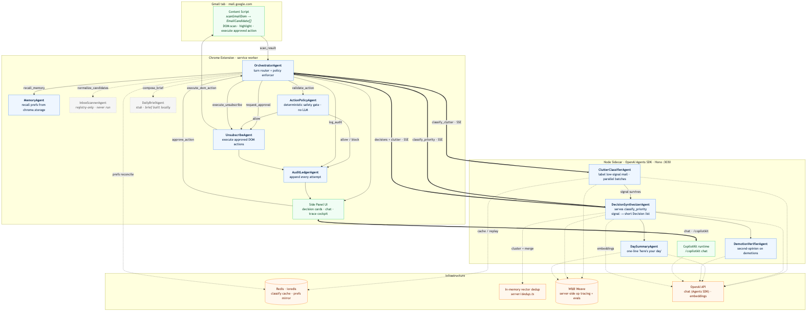

# EmailSignal

> A Gmail "signal extractor" — runs as a Chrome extension backed by a small local Node sidecar. Reads only what you can see in Gmail. Never deletes or sends mail. Every action passes through an approval card.

EmailSignal turns a noisy inbox into a short list of **Decisions** — the few things you actually need to act on today, each one synthesized from one *or more* related emails. It is the opposite of a second inbox: it does not restate what Gmail already shows. Two recruiters waiting on you become **one** decision, not two cards. Newsletters, promotions, and notifications never become decisions at all — they flow to a separate Cleanup surface.

EmailSignal does **not** use OAuth or the Gmail API. It reads the Gmail web DOM in a content script, so you stay in control of credentials and scope.

## Architecture

EmailSignal is a genuinely multi-agent system: an in-extension Orchestrator hands off to a Node
sidecar running the **OpenAI Agents SDK**, with **Redis** for caching/memory, **W&B Weave** for
tracing + evals, and **CopilotKit** for the side-panel chat. The canonical map of every agent, its
handoffs, and where the infrastructure plugs in lives in **[docs/architecture.md](docs/architecture.md)**:

[](docs/architecture.md)

<sub>Blue = active agent · dashed = registry-defined but dormant · green = UI/runtime · orange = infrastructure. Thick arrows cross the extension ↔ sidecar boundary over SSE. The source is Mermaid — see [docs/architecture.md](docs/architecture.md).</sub>

---

## How it works

EmailSignal is split in two:

- **The Chrome extension is a thin client.** It scans the visible Gmail DOM, renders surfaces, and executes approved DOM actions. It runs **no** intelligence and has **no** heuristic fallback.
- **A local Node sidecar does all the intelligence.** It classifies clutter and synthesizes decisions using the OpenAI Agents SDK, streamed back over SSE.

If the sidecar is unreachable or no OpenAI key is configured, the extension throws a `SidecarError` (`src/agents/llm-runner.ts`), the affected surfaces show an honest error state, and the ambient status indicator goes red. There is **no silent fallback** — the tool tells you when it can't think.

```
                 ┌────────────────────┐                       ┌─────────────────────────┐
   Gmail tab     │ Content script     │   ScanResult (DOM)    │ Node sidecar (Hono)     │
 (mail.google) ──┤ • DOM scanner      ├──────────────────────►│  localhost:3030         │
                 │ • Highlighter      │                       │                         │
                 │ • DOM action exec  │◄──── approved action ─┤ • ClutterClassifier     │
                 └─────────┬──────────┘                       │ • DecisionSynthesizer   │
                           │                                  │ • Redis classify cache  │
                 ┌─────────▼──────────┐   SSE: classification │ • Vector dedup (embeds) │
                 │ Service worker     │◄────────  + decisions ┤ • Preference reconcile  │
                 │ • message bus      │                       │ • W&B Weave tracing     │
                 │ • policy gate      │   SSE: chat_reply /   │ • CopilotKit runtime    │
                 │ • action ledger    │◄──────── CopilotKit ──┤                         │
                 └─────────┬──────────┘                       └─────────────────────────┘
                           │
                 ┌─────────▼──────────────────────────────┐
                 │ Side panel (React)                      │
                 │ Today · Cleanup · Chat · Actions · Settings
                 └─────────────────────────────────────────┘
```

### The intelligence (sidecar)

All classification and synthesis lives in [`server/agents.ts`](server/agents.ts) and runs on the **OpenAI Agents SDK** (`@openai/agents`, model `gpt-4.1-mini` by default):

| Agent | Job |
|---|---|
| **ClutterClassifierAgent** | Labels low-signal mail in parallel batches — promotion / newsletter / marketing / cold outreach / automated notification / social update / receipt. It is explicitly told **not** to classify real-person mail, and a failed deploy / security alert / payment problem is treated as *signal*, not clutter. |
| **DecisionSynthesizerAgent** | Turns the remaining signal into a SHORT list of `Decision`s — verb-led title in the user's voice, a one-line *why*, a theme, an urgency, optional due date and action. Reasons about **time** (see below). Folds related emails together; returns an empty list ("Nothing pressing") rather than padding. |
| **DaySummaryAgent** | Writes the one-line "here's your day" summary over the final *active* decisions — honest by construction (no decisions → no line). |

Only **definite** noise (promotion/newsletter/marketing/cold-outreach/automated-notification/social-update) is removed before synthesis. Ambiguous categories (other / receipt / repeat-sender) stay in, so an over-eager clutter label can never bury a personal reply.

Two cost optimizations sit around the agents:

- **Exact-match classify cache (Redis).** A rescan of an unchanged inbox under unchanged preferences replays the derived result instead of re-running ~20 OpenAI calls. The cache key is namespaced by a *hashed* account address, the candidate id-set, and the user's preferences. A partially-failed run is never cached.
- **Vector dedup of decisions.** When synthesis produces more than the short-list cap, decisions are embedded and clustered to merge duplicates deterministically (`server/embeddings.ts`, `server/dedup.ts`) — ~100× cheaper than an LLM consolidation pass, with an LLM merge only as a fallback.

**Sender names are resolved server-side** (`resolveSenderName`), so no surface ever shows `noreply@…` or a raw address.

### Time awareness

EmailSignal reasons about *when* something matters, not just how old the email is — because **recency is not relevance**. An unpaid bill from six weeks ago is *more* urgent with age; a flight booked months ago for tomorrow is critical; but a viewing that already happened, or a resolved overspend alert, is dead.

- The Gmail scanner captures each email's absolute received date (`receivedAt`, from the row's date-cell `title` attribute), and the sidecar anchors every prompt with **"TODAY IS …"** so the model resolves relative dates ("the 15th", "next Tue") against the email's own date, never its training cutoff.
- The synthesizer tags each decision with a `windowType` — `deadline` (owed until done — escalates as it nears and when overdue), `event` (a moment that passes), or `standing` — and a `resolved` flag set only on explicit in-thread evidence (a later "paid"/"confirmed"/your own reply).
- Ranking keeps urgency primary but reorders by the **next relevant moment**: due-soon and overdue deadlines rise; a gentle continuous recency tiebreaker separates equals (no hard age cliff).
- Stale standing items, passed events, and resolved threads are **demoted** — never hidden — into a quiet, collapsed **"Likely past — handled?"** group, with a hedged one-liner ("from about 3 weeks ago — likely already handled"). Money, security, real future deadlines, and high/critical items are exempt from age demotion, because hiding a live item is far worse than surfacing a dead one.

> The richer multi-agent registry in [`src/agents/agent-defs.ts`](src/agents/agent-defs.ts) (orchestrator, policy, unsubscribe, audit, memory, …) governs the **action** pipeline and chat. The live *classification* path is the two sidecar agents above; the older heuristic and priority/brief paths have been removed.

### Surfaces (side panel)

- **Today** — the ranked list of `Decision` cards. This is the product.
- **Cleanup** — clutter grouped for safe, reversible tidying (mark-read / archive / unsubscribe), behind approvals.
- **Chat** — a conversation about your inbox, powered by **CopilotKit** generative UI against the sidecar's `/copilotkit` runtime.
- **Actions** — the permanent ledger of every proposed / approved / executed / blocked action.
- **Settings** — sidecar URL (default `http://localhost:3030`), OpenAI key, chat model, W&B Weave key/project, dry-run, and kill switch. The key/model/Weave fields are **Settings-first**: a non-empty value is forwarded to your sidecar and takes precedence over `server/.env`; leave a field blank to fall back to the env value.

### Data contracts

Strict Zod schemas under [`src/schemas`](src/schemas) govern every boundary:

- `EmailCandidate`, `EmailThreadSummary`, `ScanResult`
- `Decision` — the core synthesis unit (Today); carries temporal fields (`windowType`, `resolved`, `receivedAt`, `demoted`, `demotedReason`)
- `ClutterFinding`, `ClutterSenderGroup` — Cleanup
- `ProposedAction`, `ApprovalRecord`, `ExecutedAction`, `ActionLedgerEntry`
- `UserPreference`, `MemoryRecord`, `MemorySuggestion`
- `AccountIdentity` — the signed-in address (scraped, hashed before caching)
- `AgentTraceEvent` — cockpit / Weave timeline
- `ExtMessage` — the wire protocol between content / background / side panel; every inbound message is `parseExtMessage`'d before use.

(`PriorityFinding` and `DailyBrief` schemas remain for compatibility but are no longer the live path.)

---

## Setup

EmailSignal needs **two** things running: the sidecar and the loaded extension.

```bash
# 1. Clone, install
git clone … && cd email-signal
npm install

# 2. Configure the sidecar
cp .env.example .env
$EDITOR .env            # set OPENAI_API_KEY (or paste the key in the extension Settings instead)

# 3. Start the sidecar (Hono, http://localhost:3030)
npm run server          # tsx watch; or `npm run server:once` for a one-shot run

# 4. Build the extension bundle
npm run build:all
```

### Loading the extension in Chrome

1. Open `chrome://extensions`.
2. Toggle **Developer mode** (top right).
3. Click **Load unpacked** and select the `dist/` directory.
4. Pin the EmailSignal icon, open Gmail, and click the icon to open the side panel.
5. In **Settings**, confirm the sidecar URL (`http://localhost:3030`) and — if you didn't put it in `server/.env` — paste your **OpenAI API key**. The extension forwards the key to your local sidecar in the request body; it is never sent anywhere except OpenAI.

The extension only has host permissions for `https://mail.google.com/*`. It cannot read or write any other tab.

### Environment variables (sidecar)

`OPENAI_API_KEY`, `EMAIL_SIGNAL_MODEL`, `WANDB_API_KEY`, and `WANDB_PROJECT` can also be set in the extension **Settings**, which take precedence; the `.env` values below are the fallback used when the matching Settings field is blank. Resolution is uniform: extension setting (if non-empty) → `process.env` → built-in default. (Changing the Weave project takes effect after a server restart — the first key/project to initialize wins.)

| Var | Default | Notes |
|---|---|---|
| `OPENAI_API_KEY` | — | Used by the sidecar. Settings-first (forwarded from the extension; `.env` is the fallback). |
| `EMAIL_SIGNAL_PORT` | `3030` | Sidecar listen port. |
| `EMAIL_SIGNAL_MODEL` | `gpt-4.1-mini` | Model for both agents. Settings-first. |
| `EMAIL_SIGNAL_BATCH_SIZE` | `25` | Candidates per parallel classifier call. |
| `REDIS_URL` | — | Enables the classify cache + cross-device preferences. Falls back to a local JSON store (`.data/memory.json`). |
| `WANDB_API_KEY` | — | Enables W&B Weave tracing. Settings-first. Without it, tracing is a silent pass-through. |
| `WANDB_PROJECT` | `email-signal` | Weave project name. Settings-first. |
| `EMAIL_SIGNAL_SEND_FULL_BODIES` | `false` | When false, only ~512-char snippets reach the model. |
| `EMAIL_SIGNAL_DRY_RUN` | `true` | Extension dry-run toggle also lives in Settings. |
| `EMAIL_SIGNAL_NOTIFY_INTERVAL_MIN` | `30` | Service-worker notification cadence; `0` disables. |

### Sidecar endpoints

| Route | Purpose |
|---|---|
| `GET /health` | Liveness + whether an OpenAI/Weave key is configured. |
| `POST /orchestrate/classify` | SSE — emits `classification` (clutter) then `decisions`. |
| `POST /orchestrate/chat` | SSE — emits `chat_reply`. |
| `ALL /copilotkit` | CopilotKit runtime for the generative-UI chat. |

---

## Safety model

EmailSignal assumes the **first thing that goes wrong is the agent doing something the user didn't intend**. Guarantees:

1. **No destructive actions, ever.** The policy gate in [`src/agents/policy.ts`](src/agents/policy.ts) hard-blocks delete / send / forward / reply action types. The deterministic gate runs *after* any LLM advice, so a hallucinated tool name cannot route around it.
2. **No external action without explicit approval.** An action is proposed, vetted by the policy gate, and rendered as an approval card. Only after the user approves does the content script act.
3. **Dry run is ON by default.** Even after approval, no DOM clicks happen until you flip the toggle. Dry-run still records to the ledger so you can review proposals end-to-end.
4. **Kill switch.** One click sets `chrome.storage.local[es.killSwitch.v1]=true` and every turn aborts.
5. **HTTPS-only unsubscribes** in a new tab (`noopener,noreferrer`). EmailSignal never auto-submits forms, never enters credentials or payment details.
6. **Memory writes require explicit approval.** Agent-proposed preferences surface as a suggestion card; only `source: 'user'` records skip approval.
7. **Bounded body excerpts.** At most ~512 chars of body reach the model unless `EMAIL_SIGNAL_SEND_FULL_BODIES=true`.
8. **Permanent ledger** of every proposed, approved, rejected, executed, and blocked action, with timestamps and agent attribution.

---

## Observability

Tracing runs **server-side** via W&B Weave. Start the sidecar with the keys set and the traces flow:

```bash
WANDB_API_KEY=…  WANDB_PROJECT=email-signal  OPENAI_API_KEY=…  npm run server
# (or put them in server/.env — see Configuration above — and just `npm run server`)
```

When `WANDB_API_KEY` is set, the sidecar calls `initServerWeave()`, then routes the OpenAI Agents SDK through a **Weave-wrapped OpenAI client** (`wrapOpenAI` + `setDefaultOpenAIClient`, switched to the Chat Completions API so `wrapOpenAI` can see generations). Each pipeline stage is a named Weave op defined **once** and reused (`email_signal.classify_clutter`, `email_signal.synthesize_decisions`, `email_signal.consolidate_decisions`, `email_signal.day_summary`, `email_signal.chat`). Every stage records the real `sessionId`/`turnId`/`model` (so all stages of one scan group together), has **nested generation spans** with the actual prompt/response and **token counts**, and is annotated with derived `inputTokens`/`outputTokens`/`totalTokens` and `cost_usd` (from a per-model pricing table in `server/agents.ts`). A failing batch marks its span as errored. Without `WANDB_API_KEY` it is a byte-for-byte, zero-overhead pass-through — no client swap, no Weave calls.

> The Chat Completions switch happens **only** when Weave tracing is active; with tracing off the SDK keeps its default (Responses API).

In the extension, `src/weave/tracing.ts` records a local trace stream (`session_start / agent_start / agent_end / error / …`) that drives the in-panel **Agent activity** cockpit and is mirrored to the side panel over `bg/trace_event`. This stream is **local-only by design** — the extension can't load the Node-only Weave SDK, so real W&B traces come exclusively from the sidecar above.

---

## Memory & preferences

- **Default** (no Redis): a local JSON store (`.data/memory.json` on the sidecar; `chrome.storage.local` in the extension).
- **Redis** (`REDIS_URL` set): preferences are stored per hashed account and **reconciled server-side** with what the extension forwards, so they sync across devices.
- Preferences (`important_sender`, `ignored_sender`, `important_topic`, `time_sensitive_category`, `liked_newsletter`) are folded directly into the synthesis prompt **and** into the classify-cache key, so changing a preference both reshapes the next result and busts the cache.

---

## Evals

Fixture-backed regression tests live in [`evals/`](evals):

```bash
npm run evals               # run the full suite
npm run eval:safety         # action policy gate must block delete/send/etc
npm run eval:memory         # memory writes always require approval
npm run eval:handoffs       # orchestrator handoff topology
npm run eval:sender         # sender-name resolution / synthesis
npm run eval:categorize     # clutter vs signal categorization
```

Each suite is a `tsx`-runnable script that loads JSON fixtures and asserts expected values, exiting non-zero on any failure so CI can wire them in.

When `WANDB_API_KEY` is set, every suite also logs a **versioned W&B Weave Evaluation** (a `weave.Dataset` + scorers) via the shared helper in [`evals/weave-eval.ts`](evals/weave-eval.ts), so runs are tracked and comparable over time — editing a fixture publishes a new dataset version rather than overwriting it. Datasets: `email-theme-categorization`, `email-safety-cases`, `email-memory-recall`, `email-handoffs`. Without the key the suites run exactly as before (local pass/fail, no Weave). The `safety`/`memory`/`handoffs` suites are deterministic (no LLM); only `categorize` needs `OPENAI_API_KEY`.

---

## Limitations

- **Gmail DOM is the only provider.** Outlook lives in [`src/providers/outlook.ts`](src/providers/outlook.ts) as a stub.
- **No Gmail API / OAuth.** Actions are limited to what's reachable from a visible row selector.
- **The sidecar is required.** No key / no sidecar → honest error state, never a degraded guess.
- **Single account at a time**, namespaced by the scraped (hashed) signed-in address.

---

## Roadmap

- **Outlook DOM provider** — mirror of the Gmail scanner behind the same interface.
- **Gmail / Microsoft Graph API providers** behind the `EmailProvider` interface, gated by OAuth.
- **Per-action reversal** via the ledger (undo archive / mark-read).

---

## Project layout

```
public/
  manifest.json                # Chrome MV3 manifest
  icons/

server/                        # the Node sidecar (all intelligence)
  index.ts                     # Hono server: /health, /orchestrate/*, /copilotkit
  agents.ts                    # ClutterClassifier + DecisionSynthesizer (OpenAI Agents SDK)
  cache.ts                     # Redis exact-match classify cache
  embeddings.ts                # batched OpenAI embeddings
  dedup.ts                     # vector clustering / decision dedup
  memory.ts                    # server-side preference reconcile
  trace-bridge.ts              # SSE writer (streams trace events to the extension)

src/
  schemas/                     # Zod contracts (single source of truth)
  agents/
    agent-defs.ts              # agent names + instructions (topology)
    orchestrator.ts            # in-extension turn dispatch
    llm-runner.ts              # SSE client to the sidecar (throws SidecarError)
    action-factory.ts          # builds ProposedActions
    policy.ts                  # deterministic ActionPolicy gate
    tools.ts / runtime.ts / types.ts
  background/
    service-worker.ts          # MV3 background — owns the message bus
  content/                     # DOM scanner host, action executor, highlighter
  providers/
    gmail.ts                   # DOM scanner (inbox + deep scroll-scan)
    outlook.ts                 # stub
    types.ts                   # EmailProvider interface
  common/                      # sender resolution, constants, messaging, log
  memory/                      # interface + json/redis stores
  ledger/                      # permanent action ledger
  weave/                       # local trace stream + side-panel bridge
  mock/                        # deterministic fixtures
  sidepanel/
    App.tsx                    # Today · Cleanup · Chat · Actions · Settings
    tabs/                      # DailyBriefTab(Today), ClutterTab(Cleanup), ChatTab, LedgerTab, SettingsTab
    cards/                     # DecisionCard, CleanupThemeCard, ClutterSenderGroupCard,
                               # ApprovalActionCard, BatchActionReviewPanel, MemorySuggestionCard, …
    copilot/                   # CopilotKit provider + actions
    cockpit/AgentActivityPanel.tsx
    state/                     # zustand store + chrome-runtime bridge

evals/
  fixtures/{categorization,safety,memory}.json
  {safety,memory,handoffs,synthesis,categorization}.eval.ts
  run.ts

vite.config.ts                 # CRXJS-powered MV3 build
vite.sidepanel.config.ts       # standalone web build of the side panel
.env.example
```
