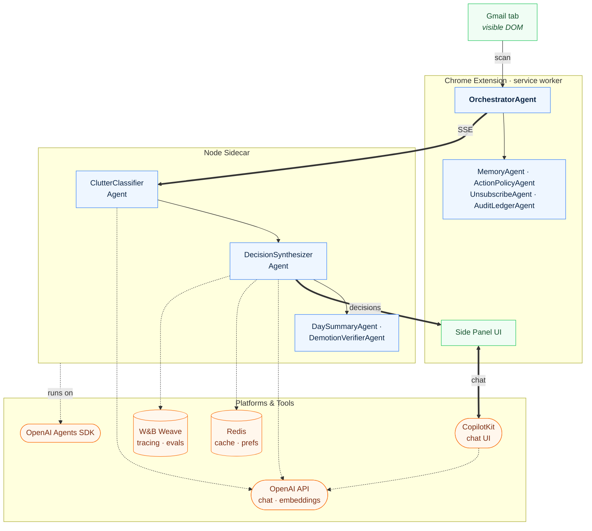
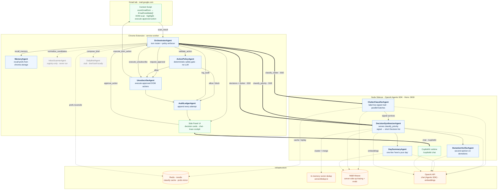

# EmailSignal — Agent Architecture

> The canonical map of EmailSignal's agents, their handoffs, and where the infrastructure
> (OpenAI Agents SDK, Redis, W&B Weave, CopilotKit) plugs in. This diagram is **reviewed
> against the code**, not aspirational — see the per-agent table for which registry agents
> actually run today.

EmailSignal is a multi-agent system split across two runtimes:

- A **Chrome extension** (service worker) that scans the visible Gmail DOM, routes each turn
  through an **Orchestrator**, gates every action through a deterministic policy, and executes
  approved DOM actions.
- A **local Node sidecar** that runs the intelligence on the **OpenAI Agents SDK**
  (`@openai/agents`) — clutter classification, decision synthesis, the day summary, a demotion
  verifier, and the CopilotKit chat runtime.

The extension calls the sidecar over **SSE** (`classifyViaSidecar` / `chatViaSidecar` in
[`src/agents/llm-runner.ts`](../src/agents/llm-runner.ts) → `POST /orchestrate/classify` and
`/orchestrate/chat`), and the side panel talks to the **CopilotKit runtime** at `/copilotkit`.

## At a glance

The active agents and the platforms each runtime depends on — OpenAI Agents SDK, OpenAI API,
Redis, W&B Weave, and CopilotKit. (Jump to the [detailed view](#detailed-view) for every handoff
edge and dormant agent.)

## Detailed view

Every agent (including dormant ones), each handoff edge, and the full infra wiring.

## Legend

| Edge | Meaning |
|---|---|
| **Solid arrow** `→` | Handoff / data flow between agents (one of the nine `AgentHandoffKind`s in [`src/agents/types.ts`](../src/agents/types.ts), or a local return). |
| **Thick arrow** `⇒` | Crosses the **extension ↔ sidecar boundary** over SSE (`/orchestrate/classify`) or the CopilotKit channel (`/copilotkit`). |
| **Dashed arrow** `-.->` | Infrastructure call (OpenAI, Redis, in-memory dedup, Weave) — not an agent handoff. |
| **Dashed-border box** | Registry agent that is **defined but dormant** — see the table. |

Handoffs are how the Orchestrator narrates and audits a turn. The nine kinds are enumerated in
`AgentHandoffKindSchema`: `normalize_candidates`, `classify_clutter`, `classify_priority`,
`recall_memory`, `validate_action`, `request_approval`, `execute_unsubscribe`, `log_audit`,
`compose_brief`. Each edge above is labeled with the kind it carries; the actual work is done by
direct function calls (in the extension) or Agents SDK `run()` calls (in the sidecar).

## Agents

All extension-side agents are declared in `AGENT_REGISTRY`
([`src/agents/agent-defs.ts`](../src/agents/agent-defs.ts)); the registry is the *intended*
topology. Three sidecar agents are created ad-hoc in [`server/agents.ts`](../server/agents.ts)
and are not in the registry. The **Runs?** column reflects what executes today.

| Agent | Where | Runs? | Role |
|---|---|---|---|
| **OrchestratorAgent** | Extension (scan/action) + sidecar (chat) | ✅ | Router, not executor. Plans each turn, recalls prefs, fans out classify batches over SSE, gates actions through policy/approval, logs every attempt. |
| **MemoryAgent** | Extension | ✅ | Recalls `UserPreference`s from `chrome.storage` before prioritization; surfaces new memory as suggestions, never writes silently. |
| **ClutterClassifierAgent** | Sidecar | ✅ | Labels bulk/automated/promotional mail in parallel batches via the Agents SDK. Told **not** to touch real-person mail. |
| **DecisionSynthesizerAgent** | Sidecar | ✅ | Serves the `classify_priority` handoff. Turns surviving signal into a SHORT list of `Decision`s, folding related emails together. (Registry name `PriorityClassifierAgent` maps here.) |
| **DaySummaryAgent** | Sidecar | ✅ | Writes the one-line "here's your day" over the final active decisions. |
| **DemotionVerifierAgent** | Sidecar | ✅ | Second-opinion safety check — re-reads demoted decisions and restores any still genuinely live (default on; not in registry). |
| **ActionPolicyAgent** | Extension | ✅ | The safety gate — but **deterministic** (`checkPolicy` in [`src/agents/policy.ts`](../src/agents/policy.ts)), not an LLM. Validates proposer, permission, risk, reversibility. |
| **UnsubscribeAgent** | Extension | ✅ | Executes only **approved** `click_unsubscribe` actions; dispatches `execute_dom_action` to the content script. |
| **AuditLedgerAgent** | Extension | ✅ | Appends every executed/blocked attempt to the local ledger; answers "what did you do today" queries. |
| **PriorityClassifierAgent** | (registry name) | — | Registry name for the `classify_priority` handoff; the sidecar serves it with **DecisionSynthesizerAgent** (above). |
| **InboxScannerAgent** | Extension | 🚫 | Defined in the registry (`normalize_candidates`) but **never instantiated** — normalization happens inline in the content script today. Shown dashed. |
| **DailyBriefAgent** | Extension | 🚧 | The `compose_brief` target, but a **stub**: the brief is assembled locally without an agent run. Shown dashed. |

## Infrastructure

| Piece | Where | Role |
|---|---|---|
| **OpenAI Agents SDK** (`@openai/agents`) | Sidecar | Every sidecar agent is a `new Agent({...})` invoked with `run()` ([`server/agents.ts`](../server/agents.ts)). No `Runner` / SDK-level `handoffs` — orchestration is explicit `Promise.allSettled` fan-out. |
| **Redis** (ioredis) | Sidecar | Two uses only: an **exact-match classify cache** ([`server/cache.ts`](../server/cache.ts), 7-day TTL, hashed account + id-set + prefs key) that replays a rescan instead of ~20 OpenAI calls, and a **preferences mirror** ([`server/memory.ts`](../server/memory.ts)) reconciled per account. It does **not** store dedup vectors. |
| **In-memory vector dedup** | Sidecar | When synthesis exceeds the short-list cap, decisions are embedded and clustered in-process ([`server/dedup.ts`](../server/dedup.ts), [`server/embeddings.ts`](../server/embeddings.ts)) — ~100× cheaper than an LLM consolidation pass, with an LLM merge only as fallback. Not persisted to Redis. |
| **W&B Weave** | Sidecar | Server-side op tracing: each stage (`classify_clutter`, `synthesize_decisions`, `consolidate_decisions`, `day_summary`, `verify_demotions`, `chat`) is wrapped in a `weave.op`, and the OpenAI client is `wrapOpenAI`'d so generations nest as spans. Also hosts the versioned Evaluations. The extension's "trace cockpit" is a **local** `chrome.storage` timeline ([`src/weave/tracing.ts`](../src/weave/tracing.ts)), not Weave. |
| **OpenAI API** | Sidecar | Chat completions via the Agents SDK (routed through the Weave-wrapped client when tracing is on) and `text-embedding-3-small` embeddings for dedup. |
| **CopilotKit** | Runtime in sidecar (`/copilotkit`), client in side panel | The chat runtime (`CopilotRuntime` + `OpenAIAdapter`) lives in the Node sidecar ([`server/index.ts`](../server/index.ts)); the side panel ([`src/sidepanel/copilot/`](../src/sidepanel/copilot/)) is a thin React client that forwards the key/model and renders the generative-UI cards. |

## Scope

This is the agents-and-infra altitude. The wire protocol between extension and sidecar is the
source of truth for message shapes — see [`src/schemas/messaging.ts`](../src/schemas/messaging.ts).
Keep this diagram in sync with `src/agents/types.ts` (handoff kinds), `AGENT_REGISTRY`, and
`server/agents.ts` when the topology changes.
